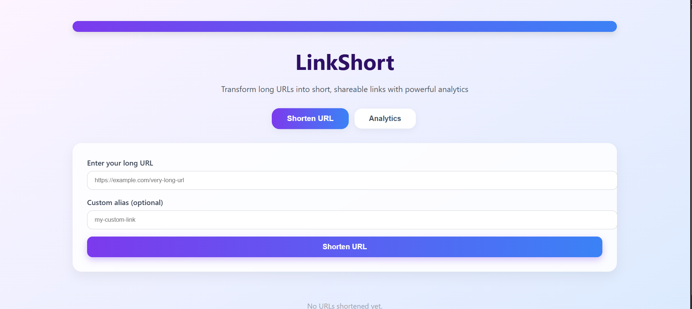
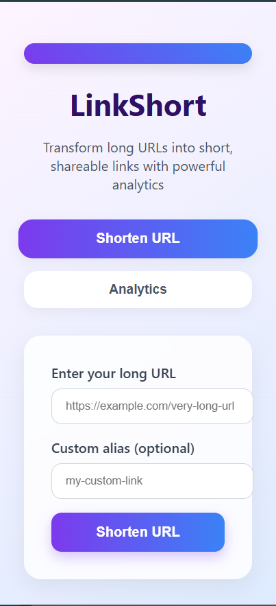

# 🔗 LinkShort - URL Shortener with Analytics

LinkShort is a modern and minimalistic URL shortener application built using **React.js**. It allows users to transform long links into short, manageable URLs with optional custom aliases and provides insightful click analytics — all stored on the client side using `localStorage`.

---

## 🚀 Features

- 🔗 Shorten any long URL
- 📝 Create custom aliases for short links
- 📊 View analytics including:
  - Total URLs created
  - Total clicks
  - Average clicks per URL
  - Today's click activity
- 📅 Track click timestamps per URL
- 📋 One-click copy to clipboard
- 🗑️ Remove unwanted links easily
- 🌐 Fully responsive and mobile-friendly
- 🎨 Attractive and intuitive UI

---

## 🛠️ Technologies Used

- **React.js**
- **CSS3** (custom, responsive styles)
- **Lucide Icons**
- **localStorage** (for data persistence)

---

## 📊 Snapshots

- **Desktop**:
  
- **Mobile**:
  

---

## 📦 Getting Started

### 1. Clone the Repository
```bash
git clone https://github.com/Arpita244/url-shortener.git
cd url-shortener
```

### 2. Install Dependencies
```bash
npm install
```

### 3. Start the Development Server
```bash
npm start
```

The app will be available at `http://localhost:3000`

---

## ✨ Future Enhancements

- Backend integration for persistent data
- QR Code generation for short links
- User login and dashboard
- Expiry time for links
- Analytics dashboard with charts

---

## 👩‍💻 Author

**Arpita Tiwari**

Feel free to connect and share feedback!

---

## ⭐ Show Your Support

If you liked this project, please consider giving it a ⭐ on [GitHub](https://github.com/Arpita244/url-shortener)!
